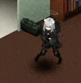

# PZ Mod Manager

<div align="center">



**Ứng dụng quản lý Server và Mod cho Project Zomboid**

[](https://nextjs.org/)
[](https://www.typescriptlang.org/)
[](https://tailwindcss.com/)

</div>

---

##  Tính năng

-  **Dashboard** - Tổng quan server với RCON console
-  **Cài đặt Server** - Chỉnh sửa file `servertest.ini` và `SandboxVars.lua`
-  **Quản lý Mod** - Xem, thêm, xóa mod từ Steam Workshop
-  **Dark/Light Mode** - Chuyển đổi giao diện sáng/tối với animation
-  **RCON Integration** - Kết nối và điều khiển server qua RCON

---

##  Cài đặt

### Yêu cầu

- [Node.js](https://nodejs.org/) >= 18.x
- [npm](https://www.npmjs.com/) hoặc [yarn](https://yarnpkg.com/)
- Project Zomboid Dedicated Server

### Bước 1: Clone project

```bash
git clone https://github.com/your-username/project-zomboid-UI-mod-manger.git
cd project-zomboid-UI-mod-manger
```

### Bước 2: Cài đặt dependencies

```bash
npm install
```

### Bước 3: Cấu hình môi trường

Tạo file `.env.local` trong thư mục gốc:

```env
# Steam API Key (để lấy thông tin mod từ Workshop)
STEAM_API_KEY=your_steam_api_key_here

# Đường dẫn mặc định đến thư mục server (tùy chọn)
ZOMBOID_SERVER_PATH=F:\servers\Zomboid\Server
```

### Bước 4: Chạy ứng dụng

```bash
# Development mode
npm run dev

# Production build
npm run build
npm start
```

Mở trình duyệt và truy cập: **http://localhost:3000**

---

##  Cấu trúc dự án

```
project-zomboid-UI-mod-manger/
├── app/                    # Next.js App Router
│   ├── api/               # API Routes
│   │   ├── files/         # Đọc/ghi file config
│   │   ├── mods/          # Quản lý mod
│   │   ├── rcon/          # RCON connection
│   │   └── steam-workshop/ # Steam Workshop API
│   ├── globals.css        # Global styles + Dark/Light mode
│   ├── layout.tsx         # Root layout
│   └── page.tsx           # Main page
├── components/            # React components
│   ├── Dashboard.tsx      # Dashboard chính
│   ├── ServerSettings.tsx # Cài đặt server
│   ├── ModManager.tsx     # Quản lý mod
│   ├── NavSidebar.tsx     # Sidebar navigation
│   ├── GlassDropdown.tsx  # Custom dropdown
│   └── Toast.tsx          # Toast notifications
├── data/                  # Metadata
│   ├── serverSettingsMeta.ts  # Mô tả settings INI
│   └── sandboxVarsMeta.ts     # Mô tả SandboxVars
├── public/
│   └── assets/
│       └── logo.gif       # Logo animation
└── tailwind.config.js     # Tailwind configuration
```

---

##  Cấu hình trong code

### Dark/Light Mode

Được cấu hình trong `tailwind.config.js`:

```javascript
module.exports = {
  darkMode: "class", // Class-based dark mode
  // ...
};
```

Theme được lưu trong `localStorage` với key `theme`.

### RCON Settings

Cấu hình RCON được lưu trong `localStorage`:

```javascript
{
  host: "127.0.0.1",
  port: 27015,
  password: "your_rcon_password"
}
```

### Server Settings Metadata

Định nghĩa trong `data/serverSettingsMeta.ts`:

```typescript
export const COMMON_SETTINGS = [
  { key: 'ServerName', label: 'Server Name', type: 'string', ... },
  { key: 'MaxPlayers', label: 'Max Players', type: 'integer', ... },
  // ...
]
```

### API Endpoints

| Endpoint              | Method         | Mô tả                         |
| --------------------- | -------------- | ----------------------------- |
| `/api/files/list`     | GET            | Liệt kê file trong thư mục    |
| `/api/files/read`     | GET/POST       | Đọc/ghi file config           |
| `/api/mods`           | GET/PUT/DELETE | Quản lý mod                   |
| `/api/rcon`           | POST           | Gửi lệnh RCON                 |
| `/api/steam-workshop` | GET            | Lấy thông tin mod từ Workshop |

---

##  Screenshots

> _Coming soon..._

---

##  License

MIT License - Xem file [LICENSE](LICENSE) để biết thêm chi tiết.

---

<div align="center">

[](https://github.com)

_@2025_

</div>
